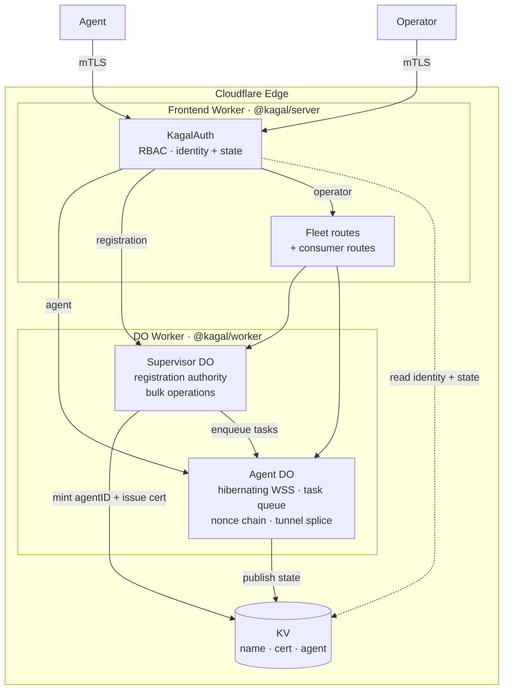
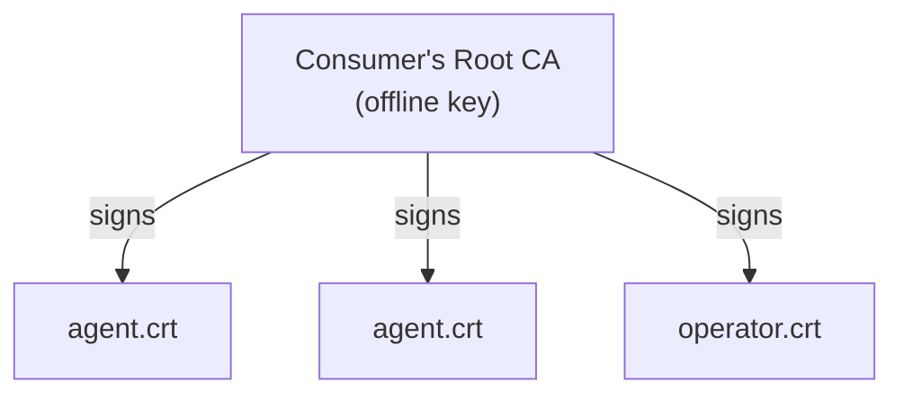
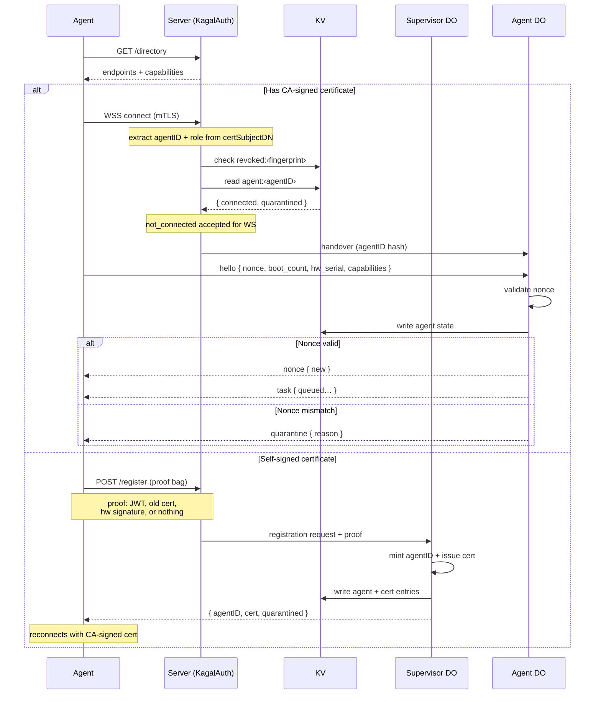
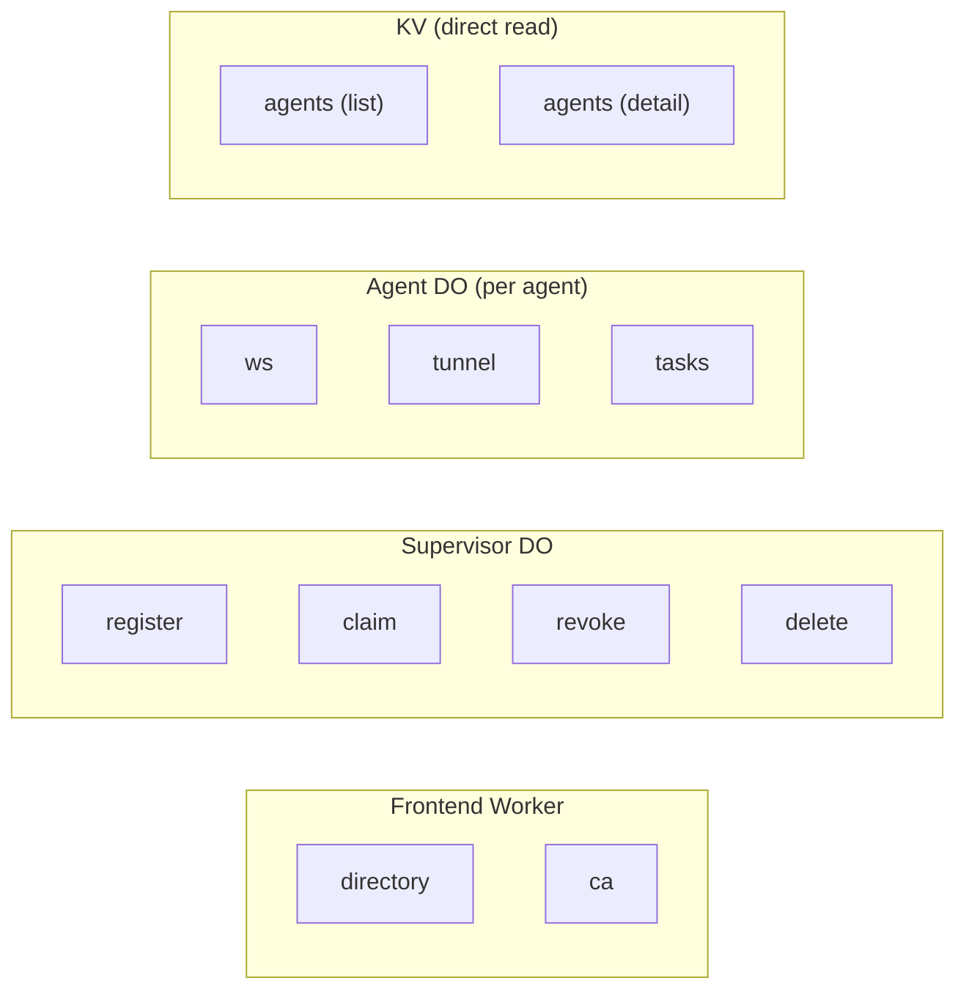

<!-- cSpell:words certless cloudflared codegen hono itty -->
<!-- cSpell:words kagalctl TASKQ unquarantine unquarantined -->

# Kagal — Design Document

> *Kagal* (𒆍𒃲, Ká.Gal) — Sumerian for "Great Gate".

A library for managing agent fleets over
Cloudflare's edge.

## Overview

Kagal is a **library** for building fleet
management platforms on Cloudflare Workers. It provides
the primitives for connecting thousands of agents behind
NAT to a central control plane: persistent control
channels, on-demand tunnels, task dispatch, mTLS
authentication, and clone detection — all running on
Cloudflare's edge with zero idle cost.

Kagal ships as four npm packages:

- **`@kagal/proto`** — Generated protobuf-es types for
  the wire protocol. Published from the proto schema
  at [`proto/kagal/v1/`][proto-v1].
- **`@kagal/worker`** — Durable Object library. Exports
  Agent DO (per-agent WebSocket, SQLite task queue,
  nonce chain, tunnel splice) and Supervisor DO
  (registration authority, bulk operations).
- **`@kagal/server`** — Server library for frontends.
  Exports `createKagalRouter()` (route list + catch-all
  handler) and `kagalAuth()` for consumer routes that
  need mTLS access to agents or operators beyond what
  `@kagal/server` manages internally (e.g. firmware,
  backups, custom APIs). Portal routes use the
  consumer's own auth. The consumer mounts Kagal into
  their own Worker (Hono, itty-router, Nitro, raw
  fetch handler — whatever they prefer).
- **`@kagal/agent`** — TypeScript agent CLI and library
  built with citty. Manages the control WebSocket,
  nonce rotation, task execution, and reconnection.
  Extensible for domain-specific agents.

A Go module (`kagal.dev`) is planned for after the
TypeScript packages stabilise.

### Why?

Cloudflare Tunnels (`cloudflared`) has a hard limit of
1,000 tunnels per account (Free and Pay-as-you-go).
Enterprise pricing is required to raise this. Kagal
replaces `cloudflared` with a lightweight architecture
that scales to unlimited agents at ~$5/month.

### Design Principles

- **Library, not framework**: Kagal doesn't own your
  HTTP router or your application logic. You import
  what you need.
- **Zero idle cost**: Durable Object WebSocket
  Hibernation means 2,000 connected-but-idle agents
  cost nothing.
- **mTLS-everywhere**: Every connection uses mTLS.
  Agents without a CA-signed certificate present a
  self-signed certificate. No passwords, no API keys.
- **Clone-aware**: A rolling nonce protocol detects
  cloned agents and quarantines them until a human
  intervenes.
- **Offline-resilient**: Agents can go offline for
  years and reconnect. Expired certs trigger a grace
  flow, not a brick.

---

## Architecture



### What Kagal Provides vs. What the Consumer Provides

| Kagal provides | Consumer provides |
|----------------|-------------------|
| Agent DO (WebSocket, task queue, nonce chain, tunnel splice) | Worker entry point and HTTP router |
| Supervisor DO (registration authority, bulk operations) | Application-specific coordination logic |
| RBAC access control (KagalAuth) | KV namespace binding |
| KV-backed routing (name, cert, agent records) | Cert issuance callback (CA) |
| Agent library (control loop, reconnect, task dispatch) | Task handler implementations |
| Clone detection + quarantine protocol | Quarantine resolution UI/workflow |
| Tunnel splice (port forwarding) | Tunnel client (ProxyCommand, etc.) |
| `kagalAuth()` for consumer mTLS routes | Portal auth (OAuth, sessions, etc.) |

Application-specific storage (firmware, backups) is
**not** part of core — consumers implement their own
R2/D1/KV routes.

---

## Identity Model

Kagal separates cryptographic identity from human
naming:

- **agentID** — Opaque, server-assigned by the
  Supervisor DO. Immutable for the lifetime of a
  registration. Re-registration always mints a new
  agentID. Used internally for DO routing
  (`idFromName(agentID)`), KV keys, and cert
  bindings.

- **name** — Human-meaningful, unique, assigned by
  an operator during quarantine resolution. Can be
  reassigned: a dead device's name can move to its
  replacement. An agent that re-registers can reclaim
  its old name once a human confirms its identity.

KV is the routing layer between these two:

| Key | Value |
|-----|-------|
| `name:<name>` | `{ agentID }` |
| `agent:<agentID>` | `{ name, connected, quarantined, groups, ... }` |
| `cert:<fingerprint>` | `{ agentID, registered_at }` |

The server and Supervisor resolve names and cert
fingerprints to agentIDs via KV, then derive the DO
stub from the agentID hash. No in-memory registry.

---

## PKI — Private Certificate Authority

Kagal uses a private CA for agent authentication.
**Every connection uses mTLS** — there is no certless
path. Agents without a CA-signed certificate generate
a keypair locally, create a self-signed certificate,
and present it during the TLS handshake. Cloudflare
sees `certPresented === '1'` but
`certVerified === 'NONE'` for self-signed certs; the
Worker distinguishes signed from unsigned via
`certVerified`.

Each CA-signed agent certificate has dual Extended Key
Usage (`serverAuth` + `clientAuth`). The CA certificate
is uploaded to Cloudflare so it can validate incoming
client certs via `request.cf.tlsClientAuth`.

### PKI Hierarchy



Kagal does **not** generate or manage the CA itself.
The consumer provides the CA — either via `@kagal/ca`
(a planned reference implementation) or their own CA.
The **Supervisor DO** calls the consumer's CA callback
to issue certificates during registration.

The CA **must** embed the agentID (or operator ID)
and role in the certificate's Subject DN. KagalAuth
reads these fields from `certSubjectDN` on every
request — this is how identity resolution avoids KV
lookups on the hot path.

### Cloudflare mTLS Fields

Cloudflare populates `request.cf.tlsClientAuth` after
mTLS is enabled on the hostname. Kagal uses
`certPresented`, `certVerified`, `certSubjectDN`,
`certFingerprintSHA256`, `certNotBefore`, and
`certNotAfter`.

| Field | CA-signed cert | Self-signed cert |
|-------|----------------|------------------|
| `certPresented` | `'1'` | `'1'` |
| `certVerified` | `'SUCCESS'` | `'NONE'` |
| `certFingerprintSHA256` | CA-issued fingerprint | Self-signed fingerprint |

See [`docs/integration.md`][integration] for mTLS
setup instructions.

---

## Access Control

KagalAuth is a stateless RBAC gateway in the Frontend
Worker. It reads the caller's identity from the TLS
certificate and the caller's state from KV, then
returns a permission set or a typed denial.

### Roles

- **agent** — a registered device connecting to its
  Agent DO.
- **operator** — a human or tool managing the fleet.
  Operator tools (kagalctl, kagal-ssh-proxy) use mTLS
  with an operator cert. The portal is consumer-owned
  (OAuth, sessions, etc.) — Kagal doesn't participate
  in portal auth; the consumer authenticates the human
  and calls Kagal's route handlers with the resolved
  identity.

Both mTLS roles (agent and operator) are resolved
from the **certificate itself** — the CA embeds
agentID (or operator ID) and role in the Subject DN.
KagalAuth reads `certSubjectDN` from Cloudflare,
extracts identity directly — no KV lookup needed for
identity resolution. KagalAuth checks agent state
only when the caller's role is `agent`. Portal
requests bypass KagalAuth entirely — the consumer's
auth layer is responsible.

### Agent States

| State | Condition | Access |
|-------|-----------|--------|
| **guest** | Self-signed cert, or no `agent:<agentID>` record in KV (includes deleted agents) | Open routes only |
| **bad_cert** | Revoked or `certVerified` failed | Permission denied (403) |
| **not_connected** | Known agent, WS not established or nonce not verified | WS connect allowed; other agent routes denied (503) |
| **quarantined** | Connected, nonce verified, but quarantined | Control WS, `cert_renew` task; operators can interact; no tunnels, no custom tasks, not listed as operational |
| **connected** | WS up, nonce verified, not quarantined | Full permissions for role |

The WS endpoint is the bootstrap route — the only
route where `not_connected` is an acceptable state.
Every other agent-facing route requires the agent to
have completed the WS + nonce handshake.

### Open Routes

The `directory`, `ca`, and `register` endpoints skip
identity resolution entirely. Any mTLS connection
(including self-signed or expired) can reach them.
The registration handler inspects the cert directly
and treats it as evidence — an expired CA-signed cert
is stronger proof than a self-signed cert. This is
how the **offline-resilient** principle works: an
agent whose cert expired re-registers with the
expired cert as proof of previous identity.

### KagalAuth Resolution

For non-open routes, KagalAuth resolves identity
from the certificate and state from KV:

1. Check `certPresented` from Cloudflare. If
   `'0'` → reject (403, no certificate).
2. Check `certVerified` from Cloudflare:
   - `'SUCCESS'` → CA-signed, proceed.
   - `'NONE'` → not CA-signed (self-signed or unknown
     CA) → **guest**.
   - `'FAILED'` → cert rejected → **bad_cert**.
3. Extract `{ id, role }` from `certSubjectDN`. If
   not parseable → **guest**.
4. Check `revoked:<fingerprint>` in KV. If exists →
   **bad_cert**.
5. If `role === 'operator'` → operator permissions
   granted. Done. *(1 KV read)*
6. If `role === 'agent'` → read `agent:<agentID>`
   from KV. If missing → **guest**. *(2 KV reads)*
7. Combine role + state flags (`connected`,
   `quarantined`) → permission set or typed denial.
   *(2 KV reads)*

### Name Resolution

Routes use agentID as the canonical `:id` parameter.
If a request uses a name, the server resolves
`name:<name>` → agentID via KV and redirects to the
canonical URL.

### State Transitions

The Supervisor creates the initial `agent:<agentID>`
entry during registration (`connected: false`,
`quarantined: true`). After first connect, the Agent
DO owns all subsequent writes to `agent:<agentID>`:

- **First connect (no nonce state)** →
  initialise nonce chain,
  `connected: true, quarantined: true`
- **WS connect + nonce valid** →
  `connected: true` (quarantine preserved from
  DO's SQLite state)
- **WS connect + nonce mismatch** →
  `connected: true, quarantined: true`
- **WS disconnect** → `connected: false`
- **`unquarantine` task received** →
  `quarantined: false`

KagalAuth reads these flags on subsequent requests.
There is a brief race window between the WS connect
and the KV write, but agents should not access
non-WS routes during that window.

---

## Agent Connection Flow

Every agent — new or returning — starts by fetching
a directory from the server. The directory describes
available endpoints and server capabilities. No
hardcoded paths.

After directory discovery, the agent takes one of two
paths depending on whether it holds a valid
certificate.



### Directory Discovery

The directory endpoint does not require identity
verification — any mTLS connection (including
self-signed) can fetch it. The response is JSON:

```json
{
  "version": 1,
  "base": "/kagal",
  "endpoints": {
    "register": "/kagal/register",
    "ws": "/kagal/agents/{id}/ws",
    "tunnel": "/kagal/agents/{id}/tunnel",
    "ca": "/kagal/pki/ca.crt"
  },
  "capabilities": ["tasks", "tunnel"]
}
```

- **version** — protocol version for compatibility
  negotiation.
- **base** — prefix for all Kagal routes.
- **endpoints** — URL templates. `{id}` is a
  placeholder the agent substitutes with its agentID.
- **capabilities** — what the server supports
  (tunnels, task types, etc.). The agent's `Hello`
  message advertises its own capabilities in return.

The directory is agent-facing. Operator endpoints
(`tasks`, `agents`, `claim`, `revoke`, `delete`) are
discovered out-of-band (documentation, kagalctl
config).

### Certified Path

An agent with a CA-signed certificate connects
directly to the agent endpoint:

1. **KagalAuth** extracts agentID + role from
   `certSubjectDN`. Checks revocation. Reads
   `agent:<agentID>` for state. For the WS endpoint,
   `not_connected` is accepted.
2. **Handover** to the Agent DO derived from
   `idFromName(agentID)`.
3. **Hello** — agent sends capabilities, nonce,
   `boot_count`, `hw_serial`. The DO validates the
   nonce and publishes state to KV.
4. **Steady state** — nonce rotation, task dispatch,
   hibernation. Non-WS routes now accessible.

### Registration Path

An agent with a self-signed certificate (or whose
CA-signed certificate was rejected) connects to the
registration endpoint. It presents whatever proof of
identity it has:

| Proof | Trust level |
|-------|-------------|
| Nothing (self-signed cert) | Lowest — anonymous device |
| JWT onboarding claim | Signed assertion from provisioning system |
| Expired CA-signed certificate | Previous identity — offline-resilient re-registration |
| Hardware signature | Device attestation |
| Combination | Highest — multiple factors |

The Supervisor evaluates the proof, mints a fresh
agentID, issues a certificate (via the consumer's CA
callback), and writes the KV entries. The agent
receives its new agentID and certificate, then
reconnects via the certified path. After the WS +
nonce handshake completes, the agent enters
`quarantined` state until an operator confirms its
identity and assigns a name.

---

## Package: `@kagal/worker` (npm)

The Durable Object library. Exports two DO classes:

- **Agent DO** — One instance per agent. Manages
  WebSocket, task queue, nonce chain, tunnel splice.
- **Supervisor DO** — Singleton. Registration
  authority, name assignment, bulk operations.

Type definitions and interfaces are in
[`packages/@kagal-worker/src/types.ts`][worker-types].

The consumer's DO Worker env extends `KagalEnv` with
their own bindings. The consumer's frontend Worker
extends `KagalServerEnv` (a `Fetcher` service binding
to the DO Worker).

`KagalWorkerConfig` is passed to
`createKagalHandler()`. It configures lifecycle hooks
and protocol parameters for the DO Worker.

---

## Package: `@kagal/server` (npm)

The server library for building fleet management
frontends. Runs in the consumer's frontend Worker.

Type definitions and interfaces are in
[`packages/@kagal-server/src/types.ts`][server-types].

`createKagalRouter(config)` returns a `KagalRouter`
the consumer mounts into their Worker. Provides both
a route list for framework adapters and a direct
`handle()` for raw fetch handlers. Forwards requests
to the DO Worker via the service binding.

Lifecycle hooks and DO-level configuration live in
`KagalWorkerConfig` (see `@kagal/worker` above).

### Endpoint Categories

Actual paths are defined in the directory response
(see [Directory Discovery](#directory-discovery)) and
detailed in [`docs/api.md`][api]. The design groups
endpoints by backend and access level:



| Endpoint | Backend | Access | Purpose |
|----------|---------|--------|---------|
| `directory` | Frontend Worker | open | Endpoint discovery |
| `ca` | Frontend Worker | open | Download root CA cert |
| `register` | Supervisor DO | open | Agent registration |
| `ws` | Agent DO | agent (not_connected ok) | Control WebSocket, hibernation |
| `tunnel` | Agent DO | agent/operator (connected) | On-demand port forwarding |
| `tasks` | Agent DO | operator | Enqueue, list, and query tasks |
| `agents` | KV | operator | List and inspect agents |
| `claim` | Supervisor DO | operator | Name assignment + unquarantine |
| `revoke` | Supervisor DO | operator | Cert revocation + disconnect |
| `delete` | Supervisor DO | operator | Remove agent + cleanup KV |

`:id` in agent-scoped endpoints is always agentID.
Requests using a name are redirected to the canonical
agentID URL (see
[Name Resolution](#name-resolution)).

Application-specific routes (firmware, backups, etc.)
are **not** part of the core router.

### Integration Examples

See the demo applications under `apps/` and
[`docs/integration.md`][integration] for framework
adapters (Hono, itty-router, Nitro) and `wrangler.toml`
templates.

- **`demo-hono/`** — Hono frontend. Mounts
  `kagal.routes` into the Hono app.
- **`demo-itty/`** — itty-router frontend. Maps
  `kagal.routes` via dynamic method dispatch.
- **`demo-vanilla/`** — Minimal frontend using raw
  fetch. Uses `kagal.handle()` as a catch-all.
- **`demo-worker/`** — DO Worker hosting Agent and
  Supervisor DOs. Re-exports the DO classes and uses
  `createKagalHandler()` as the fetch handler.

---

## Package: `@kagal/agent` (npm)

TypeScript agent library and CLI built with citty.
Manages the control WebSocket, nonce rotation, task
execution, and reconnection.

Type definitions and interfaces are in
[`packages/@kagal-agent/src/types.ts`][agent-types].

### CLI

```bash
kagal run --server https://fleet.example.com/kagal \
          --cert agent.crt --key agent.key
```

The CLI is extensible: consumers import from
`@kagal/agent` and build domain-specific agent
binaries using citty's subcommand pattern.

The agent binary acts as both a local service (daemon)
and a local client of that service. No RPC in the
first releases.

---

## Go Module: `kagal.dev`

The Go module mirrors the TypeScript agent
architecture. Consumers extend `pkg/agent` to build
domain-specific agent variants — same pattern as
`@kagal/agent`.

| Path | Description |
|------|-------------|
| [`pkg/agent`][go-agent] | Agent library (extensible) |
| [`cmd/kagal`][go-cmd-kagal] | Reference agent |
| `cmd/kagalctl` | Fleet management CLI |
| [`cmd/kagal-ssh-proxy`][go-ssh-proxy] | SSH ProxyCommand helper |
| `pkg/proto/kagal/v1` | Generated protobuf types |

`cmd/kagal` is the reference implementation built on
`pkg/agent`. Same pattern as `@kagal/agent` — local
service and local client in one binary, with RPC
planned for later releases. All binaries compile to
static binaries with zero runtime dependencies —
libraries only, no shelling out to external tools.

---

## Core Protocol

### Control Channel

Each agent maintains a single persistent WebSocket to
its Agent DO.

- **URL**: resolved from the directory's `ws` endpoint
- **Keep-alive**: `setWebSocketAutoResponse` handles
  ping/pong without waking the DO (zero cost).
- **Reconnection**: Exponential backoff with jitter:
  1s → 2s → 4s → … → max 300s. Reset on success.
- **Messages**: protobuf-es encoded binary frames.
  Heartbeats (ping/pong) remain as WebSocket protocol
  frames handled by `setWebSocketAutoResponse`.

### Message Schema

Messages are defined as Protocol Buffers in
[`proto/kagal/v1/`][proto-v1] and encoded using
protobuf-es. TypeScript types for messages
(`ServerMessage`, `AgentMessage`) are generated into
`@kagal/proto` — not hand-written. The proto module
is published to BSR as `buf.build/kagal/agent`.

Proto files are split by topic:

- [`task.proto`][proto-task] — `TaskDispatch`
  (`Struct` params), `TaskResult` (`Struct` data),
  `TaskStatus` enum
- [`nonce.proto`][proto-nonce] — `NonceRotate`
- [`agent.proto`][proto-agent] — `Hello`,
  `StatusReport` (`Struct` meta), `Quarantine`
- [`envelope.proto`][proto-envelope] — `ServerMessage`
  (server → agent), `AgentMessage` (agent → server)
  wire envelopes (oneof). Includes `Error` for
  protocol errors and `Any` extension fields for
  consumer messages.

### Hello & Capabilities

The `Hello` message is the first application-level
message after WebSocket connect. It carries the
agent's nonce, `boot_count`, `hw_serial`, and a list
of **capabilities** — task types the agent supports,
tunnel availability, firmware update support, etc.
The Agent DO uses capabilities to decide what to
dispatch. See
[Agent Connection Flow](#agent-connection-flow) for
the full sequence.

---

## Nonce Chain Protocol

The nonce chain provides **clone detection** and
**offline resilience**. Nonce validation is performed
entirely by the Agent DO — KagalAuth does not
participate.

### State

Stored in the Agent DO's `nonce_state` table (see
[`schema.sql`][schema-sql]): `nonce_current`,
`nonce_previous`, `rotated_at`, `boot_count`,
`hw_serial`.

### First Connect

When an Agent DO receives a hello with no existing
nonce state (freshly registered agent), it initialises
the nonce chain: generates `nonce_current`, stores
`boot_count` and `hw_serial`, and sends the initial
nonce to the agent.

### Validation Logic

On subsequent connects, the DO validates the agent's
nonce against its own SQLite state:

- **Matches current nonce** → OK
- **Matches previous nonce within grace period** → OK
- **Mismatch + different hw_serial** → quarantine
  (clone)
- **Mismatch + same serial, stale boot count** →
  quarantine (replay)
- **Mismatch + same serial, new boot** → quarantine
  (state loss)

Quarantine reasons: `hw_serial_mismatch` (clone),
`nonce_replay` (stale boot count), or
`nonce_mismatch_new_boot` (state loss).

After successful validation, the DO rotates the nonce
and publishes connection state to KV (see
[State Transitions](#state-transitions)).

---

## Quarantine

Quarantine restricts an agent to a minimal permission
set while its identity is unproven (see
[Access Control](#access-control) for the permission
table). There are two quarantine contexts:

### Registration Quarantine

Every newly registered agent starts quarantined. The
Supervisor minted an agentID and issued a certificate,
but no human has confirmed the device's identity.

1. Agent registers → Supervisor mints agentID + cert
2. Agent reconnects with new cert, completes nonce
   handshake, enters quarantine
3. Agent initiates an OAuth2 device authorization
   flow (consumer-configured provider) and receives
   a device code + user code + verification URI
4. Agent presents the user code to a technician
   (screen, QR, serial console — consumer-provided
   display hook)
5. Technician authorizes, agent receives the token
   and sends it to the server via the control WS
6. Server validates the token; operator assigns a
   **name** (possibly reclaiming a previous name),
   groups, etc.
7. Supervisor writes `name:<name>` → agentID in KV
   and enqueues an `unquarantine` task to the Agent DO
8. Agent DO processes the task, writes
   `quarantined: false` to KV

### Clone Detection Quarantine

The Agent DO detects a nonce mismatch and quarantines
the connection. The agent has a valid certificate and
agentID but the nonce chain proves it may be a clone.

1. Agent DO detects nonce mismatch → quarantine
2. Operator reviews: is this the real device or a
   clone?
3. If real: Supervisor enqueues a `nonce_reset` task.
   Agent DO resets the nonce chain, writes
   `quarantined: false` to KV.
4. If clone: operator revokes the cert via the
   `revoke` endpoint. Supervisor writes
   `revoked:<sha256>` to KV and enqueues a
   `disconnect` task. Agent hits `bad_cert` on
   reconnect and must re-register.

### Name History

The old agentID record stays as history — operators
can trace that a name was previously bound to a
different agentID. Names can also be reassigned to
entirely different hardware (replacing a dead device).

---

## Agent Durable Object

One instance per agent, containing all per-agent state.

### SQLite Schema

See [`packages/@kagal-worker/sql/schema.sql`][schema-sql].

### Key Behaviours

- **Hibernation**: The DO hibernates when no messages
  flow. `setWebSocketAutoResponse` handles keep-alive.
- **Nonce validation**: On hello, validates the nonce
  chain (or initialises it on first connect). See
  [Nonce Chain Protocol](#nonce-chain-protocol).
- **KV state publication**: On connect, disconnect,
  and status changes, writes `agent:<agentID>` to KV
  (connected, quarantined, last_seen). This is the
  authority that KagalAuth reads — no Supervisor
  notification needed.
- **Task dispatch**: On connect/reconnect, all `queued`
  tasks are dispatched. Tasks in `dispatched` state for
  over 5 minutes are reset to `queued` on reconnect.
  Tasks may originate from operators (via Supervisor)
  or from the Supervisor itself (`unquarantine`,
  `nonce_reset`, `cert_renew`, `disconnect`).
- **Tunnel splice**: Two tagged WebSockets
  (agent-side + client-side). Binary frames forwarded
  bidirectionally.
- **Hooks**: Calls lifecycle callbacks
  (`onAgentConnect`, `onAgentDisconnect`,
  `onAgentError`, `onQuarantine`, etc.) for consumer
  integration.

---

## Supervisor Durable Object

The Supervisor DO is the **registration authority**
and fleet coordinator. It is **not** in the agent
WebSocket path — certified agents are routed directly
to their Agent DOs, preserving the hibernation cost
model.

The Supervisor communicates with Agent DOs by
**enqueueing tasks** via the DO Worker service
binding. This is how quarantine resolution,
revocation, and deletion reach connected agents —
the task wakes the Agent DO from hibernation.

### Responsibilities

- **Registration**: Evaluates proof of identity,
  mints agentIDs, issues certificates (via the
  consumer's CA callback), and writes KV entries.
  This is the Supervisor's primary role.
- **Deletion**: The inverse of registration. Enqueues
  a cleanup task to the Agent DO, then removes
  `agent:<agentID>`, `cert:<fingerprint>`, and
  `name:<name>` entries from KV. Distinct from
  revocation (which only marks a cert invalid).
- **Name assignment**: Binds human-meaningful names
  to agentIDs during quarantine resolution. Manages
  name uniqueness and reassignment.
- **Quarantine resolution**: On claim, writes
  `name:<name>` to KV and enqueues an `unquarantine`
  task to the Agent DO.
- **Revocation**: Writes `revoked:<sha256>` to KV and
  enqueues a `disconnect` task to the Agent DO.
- **Bulk operations**: Broadcast tasks, bulk queries,
  and coordination that individual Agent DOs cannot
  handle in isolation.
- **Fleet queries**: List agents, get status. Simple
  queries go through KV directly; the Supervisor
  handles operations that span multiple agents.

---

## KV Namespace Layout

| Key Pattern | Value |
|-------------|-------|
| `name:<name>` | `{"agentID":"..."}` |
| `agent:<agentID>` | `{"name":"...","connected":true,"quarantined":false,"last_seen":"...","groups":["..."]}` |
| `cert:<sha256>` | `{"agentID":"...","registered_at":"..."}` |
| `revoked:<sha256>` | `{"revoked_at":"...","reason":"..."}` |

The `name:` key is a pointer — it resolves a
human-meaningful name to an agentID and nothing else.

The `cert:` key is an **administrative record** — not
in the KagalAuth hot path. Identity (agentID, role)
is embedded in the certificate itself and extracted
from `certSubjectDN`. The `cert:` key exists for
registration tracking, audit, and revocation lookups
(`revoked:<sha256>` references the same fingerprint).

The `agent:` key is the **permissions cache** that
KagalAuth reads on every authenticated agent request.
The Supervisor creates it during registration; the
Agent DO owns all subsequent writes. `groups` are
tags/labels for fleet filtering and UI.

---

## Tunnels

On-demand data channels for forwarding TCP ports
through the Agent DO. The DO splices a pair of tagged
WebSockets (agent-side + client-side) bidirectionally.
Tunnels are not persistent — they tear down when
either side closes.

### Port Forwarding Flow

1. Operator enqueues a `tunnel_open` task
   (`{"port": N}`) via the `tasks` endpoint
2. DO dispatches to agent via control WebSocket
3. Agent opens a data WebSocket to the `tunnel`
   endpoint (`role=agent`)
4. Agent dials `localhost:N`, splices TCP ↔ WebSocket
5. Client connects to the same `tunnel` endpoint
   (`role=client`)
6. DO splices the two WebSockets bidirectionally
7. Tunnel closes when either side disconnects

### Extensions

Tunnels and tasks are core primitives — higher-level
protocols compose on top of them. SSH access is the
primary example: `kagal-ssh-proxy` uses a tunnel for
transport, tasks for key distribution and host
verification, and `ProxyCommand` for client
integration. See [`docs/integration.md`][integration]
for SSH configuration. Other protocols (VNC, HTTP
proxy, custom RPC) can be built the same way.

---

## Cost Model

**WebSocket Hibernation** means idle agents cost
nothing. `setWebSocketAutoResponse` handles pings
without waking the DO. The DO only incurs charges when
actively processing a task or tunnel session. A fleet
of 2,000 connected-but-idle agents fits comfortably
within the Cloudflare Workers Paid plan ($5/month).

See [`docs/cloudflare-limits.md`][cf-limits] for
platform quotas, billing details, and usage estimates.

---

## Deployment Topologies

The reference architecture uses two Workers connected
by a service binding:

- **Frontend Worker** — runs `@kagal/server`, handles
  mTLS auth, fleet routes, and consumer routes.
- **DO Worker** — runs `@kagal/worker`, hosts Agent
  and Supervisor DOs.

A single-Worker topology (all-in-one) is also
possible for simpler deployments but loses upgrade
isolation between the routing layer and the DOs.

See the demo applications under `apps/` and
[`docs/integration.md`][integration] for examples.

<!-- named references -->
[worker-types]: packages/@kagal-worker/src/types.ts
[server-types]: packages/@kagal-server/src/types.ts
[agent-types]: packages/@kagal-agent/src/types.ts
[schema-sql]: packages/@kagal-worker/sql/schema.sql
[proto-v1]: proto/kagal/v1/
[proto-task]: proto/kagal/v1/task.proto
[proto-nonce]: proto/kagal/v1/nonce.proto
[proto-agent]: proto/kagal/v1/agent.proto
[proto-envelope]: proto/kagal/v1/envelope.proto
[go-agent]: pkg/agent/agent.go
[go-cmd-kagal]: cmd/kagal/main.go
[go-ssh-proxy]: cmd/kagal-ssh-proxy/main.go
[api]: docs/api.md
[cf-limits]: docs/cloudflare-limits.md
[integration]: docs/integration.md
